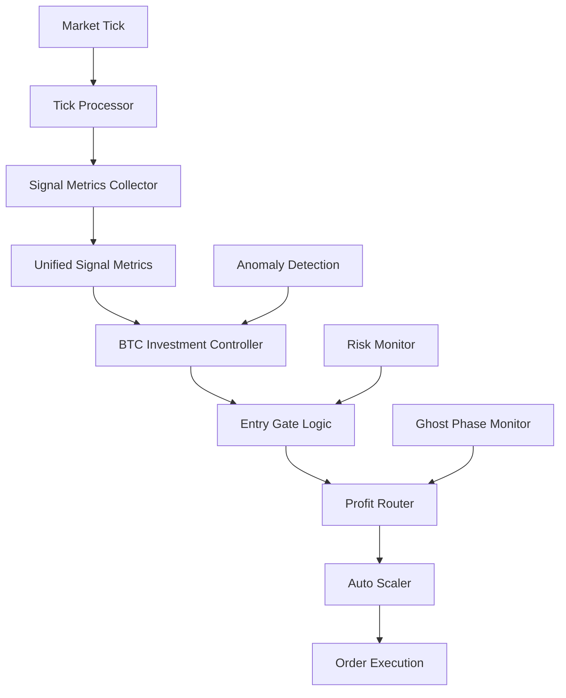

# Schwabot System Structure Documentation

## 🏗️ Architectural Overview

Schwabot 0.046 is built as a **modular, deterministic trading architecture** with clear separation of concerns and mathematical rigor. The system follows a **signal → analysis → decision → execution** pipeline with multiple layers of risk management and anomaly detection.

## 📁 Directory Structure

```
core/
├── 🧮 Mathematical Core
│   ├── unified_signal_metrics.py          # Signal consolidation & F841 elimination
│   ├── btc_investment_ratio_controller.py # 10-step investment logic
│   ├── entry_gate.py                      # Execution confidence & entry scoring
│   ├── tick_resonance_engine.py           # Harmony score calculation
│   ├── drift_phase_monitor.py             # Phase drift penalty
│   ├── profit_router.py                   # Asset allocation matrix
│   └── auto_scaler.py                     # Dynamic position sizing
│
├── 🛡️ Risk & Anomaly Management
│   ├── gan_anomaly_filter.py              # ML anomaly detection
│   ├── wall_builder_anomaly_handler.py    # Large order handling
│   ├── ghost_phase_integrator.py          # Mirror trade detection
│   └── quantum_drift_shell_engine.py      # Drift correction
│
├── 🔄 Processing Engines
│   ├── fractal_core.py                    # Pattern recognition
│   ├── triplet_matcher.py                 # Geometric analysis
│   ├── thermal_zone_manager.py            # Temperature-based routing
│   └── spectral_transform.py              # Frequency analysis
│
├── 📊 Data & Integration
│   ├── fault_bus.py                       # Event bus system
│   ├── tick_processor.py                  # Market data processing
│   ├── system_monitor.py                  # Health monitoring
│   └── unified_api_coordinator.py         # Exchange integration
│
└── 🎛️ Control & Orchestration
    ├── master_orchestrator.py             # System coordination
    ├── strategy_logic.py                  # Trading strategy logic
    ├── risk_manager.py                    # Risk assessment
    └── mode_manager.py                    # Operating mode control
```

## 🔄 Data Flow Architecture

### Primary Signal Pipeline



### Signal Flow Details

1. **Market Data Ingestion**
   ```
   Exchange API → tick_processor.py → fault_bus.py → signal_metrics.py
   ```

2. **Mathematical Analysis**
   ```
   Raw Signals → Ξ Calculation → 𝓔ₛ Scoring → Investment Decision
   ```

3. **Risk Assessment**
   ```
   Signals → Risk Level → Position Size → Allocation Matrix → Execution
   ```

4. **Anomaly Handling**
   ```
   Pattern Detection → GAN Filter → Ghost Phase Check → Fallback Logic
   ```

## 🧮 Mathematical Signal Flow

### Core Mathematical Transformations

| Stage | Input | Transformation | Output |
|-------|-------|---------------|--------|
| **Collection** | Market Data | Signal Extraction | `TradingSignalMetrics` |
| **Confidence** | T, Δθ, ε, σ_f, τ_p | Ξ = (T·Δθ) + (ε×σ_f) + τ_p | Execution Confidence |
| **Entry Score** | 𝓗, 𝓓ₚ, 𝓛, P̂ | 𝓔ₛ = 𝓗×(1−𝓓ₚ)×𝓛×P̂ | Entry Decision Score |
| **Investment** | Ξ, 𝓔ₛ, Xi_btc | Multi-factor Analysis | Investment Decision |
| **Scaling** | Confidence, Profit | Dynamic Scaling | Position Size |
| **Routing** | Decision, Phase | Matrix Selection | Asset Allocation |

### Signal Dependencies

```
Cursor Engine     → T (triplet_entropy), Δθ (theta_drift)
Fractal Engine    → ε (coherence)
Collapse Engine   → σ_f (loop_volatility), τ_p (profit_decay)
Tick Resonance    → 𝓗 (harmony)
Phase Monitor     → 𝓓ₚ (drift_penalty)
Market Analysis   → 𝓛 (liquidity_score), P̂ (projected_profit)
BTC Analysis      → Xi_btc, network_strength, hash_correlation
```

## 🛡️ Risk Management Layers

### Layer 1: Signal Validation
- **Input Bounds Checking**: All mathematical inputs validated
- **NaN/Infinity Protection**: Graceful handling of invalid values
- **Type Safety**: Full type annotations with runtime checks

### Layer 2: Confidence Thresholds
- **High Confidence**: > 1.15 (Strong Buy/Sell signals)
- **Normal Range**: 0.85 - 1.15 (Standard operations)
- **Low Confidence**: < 0.85 (Conservative/Hold mode)

### Layer 3: Anomaly Detection
- **GAN Filter**: ML-based pattern anomaly detection
- **Wall Builder**: Large order impact analysis
- **Ghost Phase**: Recursive pattern prevention

### Layer 4: Emergency Systems
- **Cooldown Management**: Prevents over-trading
- **Vault Routing**: Capital preservation during volatility
- **Fallback Logic**: Safe defaults for all failure modes

## 🔧 Integration Patterns

### Module Communication

1. **Event-Driven Architecture**
   ```python
   # Event bus for loose coupling
   fault_bus.dispatch_event('signal_update', signal_data)
   ```

2. **Named Tuple Data Contracts**
   ```python
   # Eliminates F841 errors, ensures type safety
   signals = TradingSignalMetrics(
       triplet_entropy=0.75,
       theta_drift=0.12,
       # ... other fields
   )
   ```

3. **Dependency Injection**
   ```python
   # Controllers receive dependencies, don't create them
   def analyze_investment_ratio(self, cursor_state, fractal_state, ...):
   ```

### Error Handling Strategy

```python
try:
    # Primary logic path
    result = calculate_complex_signal(data)
except (ValueError, ZeroDivisionError) as e:
    # Specific error handling
    logger.warning(f"Calculation error: {e}")
    result = safe_fallback_value()
except Exception as e:
    # Catch-all with logging
    logger.error(f"Unexpected error: {e}")
    result = conservative_default()
```

## 📊 Performance Characteristics

### Computational Complexity

| Component | Time Complexity | Space Complexity | Notes |
|-----------|----------------|------------------|-------|
| Signal Collection | O(n) | O(1) | Linear with market data points |
| Mathematical Core | O(1) | O(1) | Constant time calculations |
| Pattern Matching | O(n log n) | O(n) | Fractal analysis |
| Anomaly Detection | O(n) | O(k) | k = history window size |
| Decision Logic | O(1) | O(1) | Threshold-based decisions |

### Memory Management

- **Signal History**: Limited to 1000 entries (auto-pruning)
- **Decision History**: Limited to 1000 decisions
- **Pattern Cache**: LRU cache for fractal patterns
- **Market Data**: Rolling window approach

## 🔄 Operating Modes

### Development Mode
```python
# Mock data, extensive logging, safety checks
DEVELOPMENT_MODE = True
GAN_FILTER_MODE = "pass_all"  # No anomaly blocking
```

### Testing Mode
```python
# Backtesting with historical data
BACKTESTING_MODE = True
PAPER_TRADING = True  # No real orders
```

### Production Mode
```python
# Live trading with full risk management
PRODUCTION_MODE = True
REAL_TRADING = True
STRICT_VALIDATION = True
```

## 🧪 Testing Strategy

### Unit Testing
- **Mathematical Functions**: All equations tested with known inputs/outputs
- **Signal Processing**: Mock data validation
- **Error Handling**: Exception path testing

### Integration Testing
- **Pipeline Flow**: End-to-end signal processing
- **Exchange Integration**: API connectivity and data flow
- **Risk Management**: Threshold and fallback testing

### Performance Testing
- **Latency**: Sub-100ms decision making
- **Throughput**: High-frequency data processing
- **Memory**: Leak detection and optimization

## 🔍 Debugging & Monitoring

### Logging Strategy
```python
# Structured logging with levels
logger.info("Investment decision: {decision}, confidence: {confidence:.3f}")
logger.warning("Low liquidity detected: {liquidity_score:.3f}")
logger.error("Exchange API error: {error_details}")
```

### Health Monitoring
- **Signal Quality**: Coherence and harmony scores
- **System Performance**: CPU, memory, latency metrics
- **Exchange Connectivity**: API response times and errors
- **Risk Metrics**: Current exposure and drawdown

### Debug Utilities
```python
# Signal breakdown for analysis
def debug_signal_breakdown(signals: TradingSignalMetrics):
    return {
        "confidence_components": {
            "triplet_term": signals.triplet_entropy * signals.theta_drift,
            "coherence_term": signals.coherence * signals.loop_volatility,
            "decay_term": signals.profit_decay
        }
    }
```

## 🔧 Configuration Management

### Environment Variables
```bash
SCHWABOT_MODE=production
EXCHANGE_API_KEY=your_api_key
RISK_TOLERANCE=moderate
LOG_LEVEL=INFO
```

### Configuration Files
```yaml
# config/trading_params.yaml
confidence_thresholds:
  high: 1.15
  low: 0.85
  
position_sizing:
  max_btc_allocation: 0.80
  min_btc_allocation: 0.10
  
risk_management:
  cooldown_period: 60.0
  max_drawdown: 0.15
```

## 🚀 Deployment Patterns

### Local Development
```bash
python -m core.btc_investment_ratio_controller  # Demo mode
```

### Production Deployment
```bash
# With proper environment and monitoring
export SCHWABOT_MODE=production
python -m core.master_orchestrator
```

### Monitoring Integration
- **Prometheus**: Metrics collection
- **Grafana**: Visualization dashboards
- **AlertManager**: Critical event notifications

## 📈 Scalability Considerations

### Horizontal Scaling
- **Multiple Asset Support**: Extend beyond BTC/ETH/XRP/USDC
- **Multi-Exchange**: Parallel processing across exchanges
- **Geographic Distribution**: Latency optimization

### Vertical Scaling
- **GPU Acceleration**: For complex mathematical operations
- **Memory Optimization**: Efficient data structures
- **CPU Optimization**: Vectorized calculations

## 🔮 Future Architecture

### Planned Enhancements
- **Microservices**: Break into smaller, independent services
- **Event Streaming**: Apache Kafka for high-throughput messaging
- **Machine Learning**: Enhanced GAN and pattern recognition
- **Blockchain Integration**: Direct smart contract interaction

### Extension Points
- **Custom Strategies**: Plugin architecture for new algorithms
- **Exchange Adapters**: Standardized interface for new exchanges
- **Risk Models**: Pluggable risk assessment modules
- **Visualization**: Real-time dashboard components

---

This architecture ensures **mathematical rigor**, **operational reliability**, and **future scalability** while maintaining the deterministic behavior that makes Schwabot predictable and testable. 