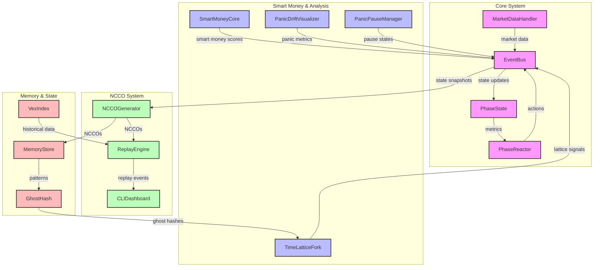

# Schwabot Architecture v0.5

## System Overview



## Component Details

### Core System
- **EventBus**: Central state management and event distribution
- **PhaseState**: Tracks all metric states across the system
- **PhaseReactor**: Policy engine for phase-based action triggers
- **MarketDataHandler**: Handles market data ingestion and processing

### Smart Money & Analysis
- **SmartMoneyCore**: Analyzes market structure, spoofing, and liquidity
- **TimeLatticeFork**: Manages ghost patterns and lattice nodes
- **PanicDriftVisualizer**: Tracks entropy and coherence metrics
- **PanicPauseManager**: Handles trading pauses during high-risk conditions

### NCCO System
- **NCCOGenerator**: Creates and manages Neural Circuit Control Objects
- **ReplayEngine**: Enables NCCO-based decision replay and analysis
- **CLIDashboard**: Real-time monitoring of NCCOs and system state

### Memory & State
- **MemoryStore**: Maintains pattern history and ghost hash mappings
- **VexIndex**: Archives historical data for replay and analysis
- **GhostHash**: Manages ghost pattern identification and tracking

## Data Flow

1. **Market Data Flow**
   - Market data enters through MarketDataHandler
   - SmartMoneyCore analyzes for spoofing and liquidity
   - Results flow to EventBus for distribution

2. **State Management**
   - EventBus maintains global state
   - PhaseState tracks metric changes
   - PhaseReactor triggers actions based on state

3. **NCCO Generation**
   - System state snapshots captured by NCCOGenerator
   - NCCOs stored in MemoryStore
   - ReplayEngine enables historical analysis

4. **Smart Money Integration**
   - Smart money scores influence trading decisions
   - Ghost patterns affect lattice node behavior
   - Panic metrics trigger safety measures

## Usage Examples

### CLI Dashboard
```bash
# Start dashboard
python -m init.cli_dashboard

# Monitor specific metrics
python -m init.cli_dashboard --metrics entropy,coherence,smart_money

# Replay specific NCCO
python -m init.cli_dashboard --replay <ncco_id>
```

### NCCO Analysis
```bash
# Generate NCCO report
python -m init.ncco_generator --report

# Replay sequence
python -m init.replay_engine --sequence <ghost_hash>

# Analyze patterns
python -m init.replay_engine --analyze --since 2025-05-01
```

### Smart Money Monitoring
```bash
# Monitor smart money signals
python -m init.smart_money_core --monitor

# Analyze spoof patterns
python -m init.smart_money_core --analyze-spoofs

# Generate liquidity report
python -m init.smart_money_core --liquidity-report
```

## Future Enhancements

1. **Smart Money Improvements**
   - Enhanced spoof detection algorithms
   - Liquidity vacuum prediction
   - Ghost pattern correlation analysis

2. **NCCO System Extensions**
   - Advanced replay visualization
   - Pattern learning from NCCO sequences
   - Automated strategy optimization

3. **Memory System Upgrades**
   - Distributed ghost hash storage
   - Pattern recognition acceleration
   - Historical data compression

4. **Integration Enhancements**
   - Real-time performance monitoring
   - Automated system health checks
   - Advanced error recovery 