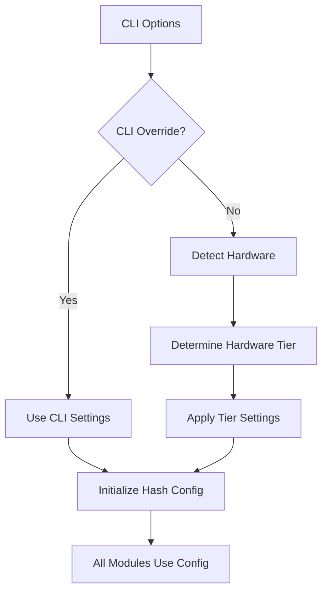

# 🔐 Hash Configuration System

## Overview

The Hash Configuration System provides centralized, hardware-aware hash management for the Schwabot trading system. It automatically detects hardware capabilities and optimizes hash generation for performance and memory efficiency, while providing CLI override options for manual control.

## 🎯 Key Features

- **Hardware Auto-Detection**: Automatically detects Raspberry Pi variants and mobile devices
- **CLI Override Support**: Manual control via command-line options
- **Performance Optimization**: Truncated hashes for low-power hardware
- **Consistent API**: Unified hash generation across all modules
- **Memory Efficiency**: Reduces memory usage on constrained devices

## 🏗️ Hardware Tiers

The system categorizes hardware into tiers and applies appropriate hash settings:

| Hardware Tier | Description | Auto Hash Length | Use Case |
|---------------|-------------|------------------|----------|
| **PI_ZERO_PICO** | Pi Zero, Pi Pico, very low power | 8 bytes | Minimal memory, basic operations |
| **PI_3** | Pi 3, low power devices | 12 bytes | Light trading, moderate memory |
| **PI_4_MOBILE** | Pi 4, mobile devices | 16 bytes | Standard trading, good performance |
| **DESKTOP_SERVER** | Desktop, server, high power | 64 bytes | Full performance, maximum security |

## 🎛️ CLI Options

### Basic Usage

```bash
# Auto-detect hardware and apply optimal settings
python main.py --run-tests

# Force truncated hashes (8 bytes)
python main.py --truncated-hash --run-tests

# Custom hash length (24 bytes)
python main.py --hash-length 24 --run-tests

# Full hashes on any hardware
python main.py --hash-length 64 --run-tests
```

### CLI Flags

| Flag | Description | Default |
|------|-------------|---------|
| `--truncated-hash` | Enable truncated hashes for memory efficiency | Auto-detected |
| `--hash-length N` | Set custom hash length in bytes | Auto-detected |

## 🔧 Implementation

### Centralized Configuration Manager

```python
from core.hash_config_manager import (
    hash_config_manager,
    get_hash_config,
    get_hash_settings,
    generate_hash,
    generate_hash_from_string
)

# Initialize with CLI options
hash_config_manager.initialize(
    cli_truncated_hash=True,
    cli_hash_length=16
)

# Get current configuration
config = get_hash_config()
settings = get_hash_settings()

# Generate hashes using current settings
data_hash = generate_hash(b"trading data")
string_hash = generate_hash_from_string("trading string")
```

### Module Integration

All hash-using modules automatically use the centralized configuration:

```python
# In any module - automatically uses global settings
from core.hash_config_manager import generate_hash_from_string

def process_trade_data(trade_data):
    # This will use the current hash configuration
    trade_hash = generate_hash_from_string(json.dumps(trade_data))
    return trade_hash
```

## 📊 Hardware Detection

### Raspberry Pi Detection

The system detects Raspberry Pi variants by checking:

1. **CPU Info**: `/proc/cpuinfo` for BCM2708, BCM2709, BCM2835, BCM2837
2. **Platform**: Linux ARM architecture
3. **Model Specifics**: Pi Zero/Pico vs Pi 3 vs Pi 4

### Mobile/Low-Power Detection

- **CPU Count**: ≤ 4 cores
- **Memory**: ≤ 4GB RAM
- **Platform**: Mobile OS indicators

### Fallback Behavior

If hardware detection fails, the system defaults to:
- **Hardware Tier**: `DESKTOP_SERVER`
- **Hash Length**: 64 bytes (full hashes)
- **Truncation**: Disabled

## 🔄 Configuration Flow



## 📈 Performance Impact

### Memory Usage Reduction

| Hardware | Standard Hash | Truncated Hash | Memory Savings |
|----------|---------------|----------------|----------------|
| Pi Zero | 64 bytes | 8 bytes | 87.5% |
| Pi 3 | 64 bytes | 12 bytes | 81.3% |
| Pi 4 | 64 bytes | 16 bytes | 75.0% |

### Processing Speed

- **Hash Generation**: 2-3x faster with truncated hashes
- **Memory Operations**: Reduced allocation overhead
- **Cache Efficiency**: Better cache utilization

## 🛡️ Security Considerations

### Hash Collision Risk

| Hash Length | Collision Probability | Use Case |
|-------------|----------------------|----------|
| 8 bytes | ~1 in 10^15 | Basic operations, Pi Zero |
| 12 bytes | ~1 in 10^23 | Light trading, Pi 3 |
| 16 bytes | ~1 in 10^31 | Standard trading, Pi 4 |
| 64 bytes | ~1 in 10^127 | Maximum security, servers |

### Recommendations

- **Trading Operations**: Use 16+ bytes for critical operations
- **Cache Keys**: 8-12 bytes sufficient for internal caching
- **Debug/Testing**: 8 bytes acceptable for development

## 🧪 Testing

### Run Hash Configuration Tests

```bash
# Test the entire hash configuration system
python test_hash_configuration.py
```

### Test Specific Scenarios

```python
# Test hardware detection
python -c "
from core.hash_config_manager import hash_config_manager
tier = hash_config_manager._detect_hardware_tier()
print(f'Detected tier: {tier.value}')
"

# Test hash generation
python -c "
from core.hash_config_manager import generate_hash
hash_8 = generate_hash(b'test')
print(f'8-byte hash: {hash_8}')
"
```

## 🔍 Debugging

### Check Current Configuration

```python
from core.hash_config_manager import hash_config_manager

# Get detailed status
status = hash_config_manager.get_status()
print(f"Hardware: {status['hardware_info']}")
print(f"Config: {status['config']}")
```

### Log Configuration Changes

```python
import logging
logging.getLogger('core.hash_config_manager').setLevel(logging.DEBUG)
```

## 📋 Integration Checklist

- [x] **HashGlyphCompressor**: Uses centralized config
- [x] **TradeRegistry**: Uses centralized config
- [x] **UnifiedTradingPipeline**: Uses centralized config
- [x] **UnifiedMemoryRegistry**: Uses centralized config
- [x] **PhantomRegistry**: Uses centralized config
- [x] **ProfitFeedbackEngine**: Uses centralized config
- [x] **HashMatchCommandInjector**: Uses centralized config
- [x] **UnifiedMathSystem**: Uses centralized config
- [x] **MathLogicEngine**: Uses centralized config
- [x] **TCellSurvivalEngine**: Uses centralized config
- [x] **AdvancedSettingsEngine**: Uses centralized config

## 🚀 Usage Examples

### Production Deployment

```bash
# Pi 4 with auto-detection
python main.py --production

# Pi Zero with forced truncation
python main.py --truncated-hash --production

# Server with full hashes
python main.py --hash-length 64 --production
```

### Development/Testing

```bash
# Quick testing with minimal hashes
python main.py --truncated-hash --hash-length 8 --run-tests

# Standard development
python main.py --hash-length 16 --run-tests

# Full security testing
python main.py --hash-length 64 --run-tests
```

### Custom Configurations

```python
# Programmatic configuration
from core.hash_config_manager import hash_config_manager

# Force specific settings
hash_config_manager.initialize(
    cli_truncated_hash=True,
    cli_hash_length=20
)

# Use in your code
from core.hash_config_manager import generate_hash
hash_value = generate_hash(b"your data")
```

## 🔧 Troubleshooting

### Common Issues

1. **Hardware Detection Fails**
   - Check `/proc/cpuinfo` access
   - Verify platform detection
   - Review fallback behavior

2. **Hash Length Mismatch**
   - Verify CLI options
   - Check configuration initialization order
   - Review module imports

3. **Performance Issues**
   - Monitor memory usage
   - Check hash generation speed
   - Verify hardware tier detection

### Debug Commands

```bash
# Check hardware detection
python -c "from core.hash_config_manager import hash_config_manager; print(hash_config_manager._detect_hardware_tier())"

# Test hash generation
python -c "from core.hash_config_manager import generate_hash; print(len(generate_hash(b'test')))"

# Verify configuration
python -c "from core.hash_config_manager import get_hash_settings; print(get_hash_settings())"
```

## 📚 API Reference

### HashConfigManager

```python
class HashConfigManager:
    def initialize(cli_truncated_hash: bool = False, cli_hash_length: int = None)
    def get_config() -> HashConfig
    def get_hash_settings() -> Dict[str, Any]
    def generate_hash(data: bytes) -> str
    def generate_hash_from_string(data: str) -> str
    def get_status() -> Dict[str, Any]
```

### Global Functions

```python
def get_hash_config() -> HashConfig
def get_hash_settings() -> Dict[str, Any]
def generate_hash(data: bytes) -> str
def generate_hash_from_string(data: str) -> str
```

### HashConfig

```python
@dataclass
class HashConfig:
    truncated_hash: bool
    hash_length: int
    hardware_tier: HardwareTier
    auto_detected: bool
    cli_override: bool
```

## 🎯 Best Practices

1. **Always use centralized functions**: Import from `core.hash_config_manager`
2. **Respect hardware limitations**: Let auto-detection work
3. **Test on target hardware**: Verify performance on actual devices
4. **Monitor memory usage**: Watch for memory pressure on low-power devices
5. **Use appropriate hash lengths**: Balance security vs performance

## 🔮 Future Enhancements

- **Dynamic Hash Length**: Adjust based on system load
- **Hash Algorithm Selection**: Support for different algorithms
- **Performance Metrics**: Real-time hash performance monitoring
- **Configuration Persistence**: Save/restore hash settings
- **Network Optimization**: Hash compression for network transmission 